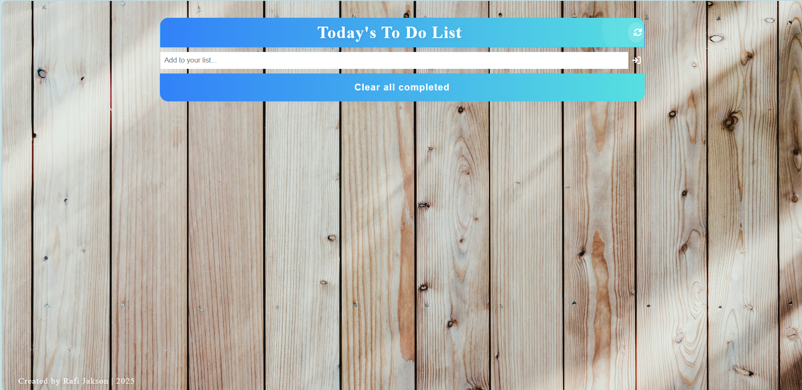

# 📝 ToDoList App

A simple and modern ToDo List web application built using HTML, CSS, JavaScript, and [Tailwind CSS](https://tailwindcss.com/). This app allows users to add, delete, and mark tasks as completed in a clean and responsive UI.

## 🚀 Features

- ✅ Add new tasks  
- 🗑️ Delete existing tasks  
- ✔️ Mark tasks as completed  
- 🌙 Dark/light mode toggle  
- 🔄 Tasks saved to local storage  
- 📱 Fully responsive design (mobile & desktop)  
- 🎨 Built with Tailwind CSS for styling  

## 📸 Preview



## 🛠️ Built With

- 
- 
- 
- 

## 📂 Folder Structure

```
ToDoList-App-main/
├── index.html          # Main HTML page
├── style.css           # Custom styles
├── script.js           # Main JavaScript logic
├── tailwind.config.js  # Tailwind configuration
├── assets              # App UI preview
└── README.md           # Project documentation
```

## 🔧 Getting Started

To run the project locally:

1. **Clone the repository**

```bash
git clone https://github.com/yourusername/ToDoList-App-main.git
cd ToDoList-App-main
```

2. **Open the HTML file**

You can directly open `index.html` in your browser.

Alternatively, use a local development server like [Live Server](https://marketplace.visualstudio.com/items?itemName=ritwickdey.LiveServer) in VS Code.

## 📌 Usage

- Type your task in the input field and click the **Add** button.
- Click the **check icon** to mark a task as done.
- Click the **trash icon** to remove a task.
- Click the **moon/sun icon** to toggle dark/light theme.

## 💡 Customization

You can customize colors, fonts, or layout by editing:

- `tailwind.config.js`
- `style.css`

## 🙋 Author

**Muhammad Hadianur Al Rafi**  
*Informatics Engineering Student @ Universitas Palangka Raya*  
